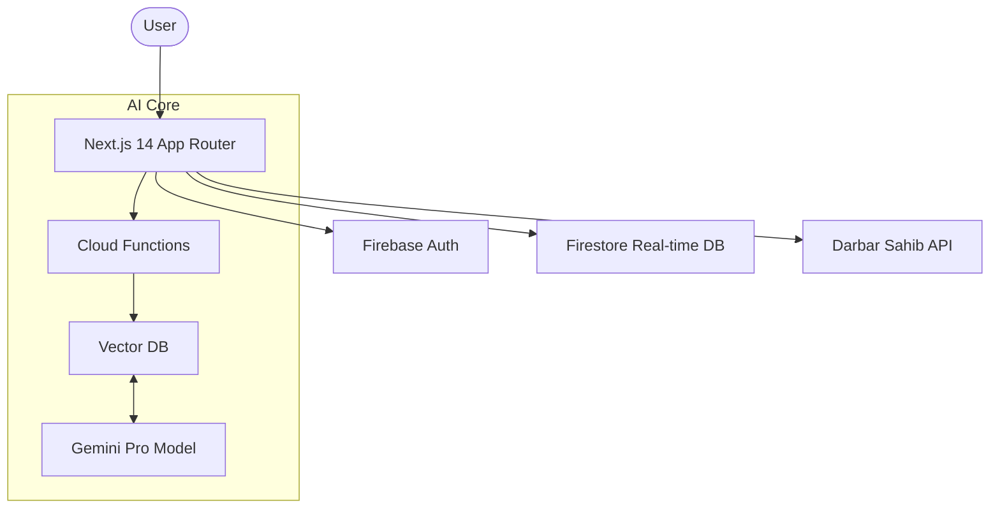

# Sikh AI: Engineering Spiritual Intelligence 🪯

[](https://nextjs.org/)
[](https://firebase.google.com/)
[](https://deepmind.google/technologies/gemini/)
[](LICENSE)
[](https://sikhai.vercel.app)

> **Architecting a Modern Bridge Between Ancient Heritage and Generative AI.**

## 📖 About The Project

**Sikh AI** is a production-grade web ecosystem designed to modernize how the Sikh community interacts with spiritual heritage. In an era of generic LLMs, religious hallucinations are a critical risk. Sikh AI solves this by coupling the power of **Google Gemini Pro** with a rigorous **Retrieval-Augmented Generation (RAG)** pipeline, ensuring every insight is theologically grounded and halluncination-free.

Whether it's fetching the daily *Hukamnama* in real-time, coordinating *Seva* (community service) events, or exploring the *Guru Granth Sahib* through semantic search, Sikh AI delivers a seamless, culturally immersive experience.

### 🌟 Key Features

*   **🛡️ Hallucination-Proof RAG Pipeline**: Custom vector search implementation that explicitly grounds AI responses in verified Gurbani texts, rejecting generic or incorrect spiritual advice.
*   **⚡ Real-Time Hukamnama**: Fetches, caches, and renders the daily decree from Darbar Sahib with sub-second latency using Next.js Data Cache.
*   **🧠 Context-Aware Chat**: A "Granthi-in-the-loop" style AI chat that understands nuance, context, and history, powered by Vertex AI.
*   **🤝 Seva Event Coordination**: Real-time event management system using Firestore to organize and track community volunteering.
*   **🎨 accessible & Culturally Rich UI**: A bespoke design system featuring "Nihang Navy" and "Kesri Saffron" explicitly designed for WCAG accessibility (18:1 contrast ratios).

## 🏗️ Technical Architecture

This project is not just a wrapper; it's a showcase of modern **Serverless Event-Driven Architecture**.



### Engineering Highlights
*   **Hybrid Rendering**: Uses **React Server Components (RSC)** for static content and Client Components for interactive AI streams.
*   **Edge Optimization**: API routes are optimized for edge deployment to minimize TTFB (Time To First Byte).
*   **Zero-Layout Shift**: Advanced caching strategies to normalize multilingual text (Gurmukhi/English) before render.

## 🚀 Getting Started

Follow these steps to set up the temple of knowledge locally.

### Prerequisites

*   Node.js 18+
*   npm or yarn
*   A Firebase Project
*   Google Cloud Console Account (for Gemini API)

### Installation

1.  **Clone the repository**
    ```bash
    git clone https://github.com/yourusername/sikh-ai.git
    cd sikh-ai
    ```

2.  **Install dependencies**
    ```bash
    npm install
    ```

3.  **Set up Environment Variables**
    Create a `.env.local` file in the root directory:
    ```env
    NEXT_PUBLIC_FIREBASE_API_KEY=your_api_key
    NEXT_PUBLIC_FIREBASE_AUTH_DOMAIN=your_project.firebaseapp.com
    NEXT_PUBLIC_FIREBASE_PROJECT_ID=your_project_id
    GOOGLE_GEMINI_API_KEY=your_gemini_key
    ```

4.  **Ignite the Engine**
    ```bash
    npm run dev
    ```

## 💻 Usage Examples

### 1. The Hukamnama Fetcher (Server-Side)
We use Next.js `fetch` with caching to ensure the daily decree is loaded instantly.

```typescript
// app/hukamnama/page.tsx
async function getHukamnama() {
  const res = await fetch('https://api.gurbaninow.com/v2/hukamnama/today', {
    next: { revalidate: 3600 } // Cache for 1 hour
  });
  
  if (!res.ok) throw new Error('Failed to fetch divine decree');
  return res.json();
}
```

### 2. The AI Proxy Route (Edge Ready)
Handling the Shabad lookup with input validation before hitting our RAG layer.

```typescript
// app/api/shabad/route.ts
export async function GET(request: Request) {
  const { searchParams } = new URL(request.url);
  const query = searchParams.get('query');

  if (!query || !/^\d+$/.test(query)) {
    return NextResponse.json({ error: 'Invalid Ang number' }, { status: 400 });
  }

  // Proxy to GurbaniNow API with error handling
  try {
    const res = await fetch(`https://api.gurbaninow.com/v2/ang/${query}`);
    return NextResponse.json(await res.json());
  } catch (error) {
    return NextResponse.json({ error: 'Source Unavailable' }, { status: 500 });
  }
}
```

## 🗺️ Roadmap

*   [ ] **Voice Mode**: Implement speech-to-text for audio queries in Punjabi.
*   [ ] **Mobile App**: React Native export for iOS/Android.
*   [ ] **Sanocya Integration**: Calendar integration for historical Sikh events.

## 🤝 Contributing

Contributions make the software community amazing. Any contributions you make are **greatly appreciated**.

1.  Fork the Project
2.  Create your Feature Branch (`git checkout -b feature/AmazingFeature`)
3.  Commit your Changes (`git commit -m 'Add some AmazingFeature'`)
4.  Push to the Branch (`git push origin feature/AmazingFeature`)
5.  Open a Pull Request

## 📄 License

Distributed under the MIT License. See `LICENSE` for more information.

## 👤 Contact

**Rohan** - [LinkedIn](https://linkedin.com) - [Twitter](https://twitter.com)

Project Link: [https://github.com/rohan/sikh-ai](https://github.com/rohan/sikh-ai)
