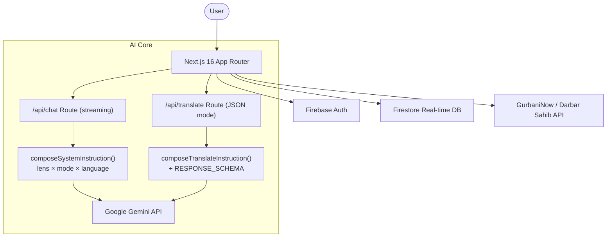

# Sikh AI: Engineering Spiritual Intelligence 🪯

[](https://nextjs.org/)
[](https://react.dev/)
[](https://firebase.google.com/)
[](https://deepmind.google/technologies/gemini/)
[](LICENSE)
[](https://sikhai.vercel.app)

> **Architecting a Modern Bridge Between Ancient Heritage and Generative AI.**

## 📖 About The Project

**Sikh AI** is a web platform designed to modernize how the Sikh community interacts with its spiritual heritage. It pairs **Google Gemini** with a carefully-tuned Sikhi system prompt and streaming responses, so answers stay rooted in the teachings of the *Sri Guru Granth Sahib Ji* rather than drifting into generic advice.

Whether it's fetching the daily *Hukamnama* from Darbar Sahib, coordinating *Seva* (community service) events, looking up Shabads from the *Guru Granth Sahib* by Ang, or translating between English and Punjabi in either script, Sikh AI aims for a calm, culturally-considered experience — now with light/dark/system theming and an accessible, mobile-friendly interface.

### 🌟 Key Features

*   **💬 Streaming, Gurbani-Guided Chat**: Responses stream token-by-token from Google Gemini (pinned to `gemini-3.8-flash`), steered by a system instruction to stay grounded in Guru Granth Sahib teachings. The answer settings — lens, style and reply language — sit as chips in the chat bar, right under the question they shape, and every answer is labelled with the settings that produced it. Every reply shows where it stands: a failed one says why in the site language and offers Retry, a reply stopped before it began says so (with Retry), and one cut short keeps its text and is marked. Asking a failed question again replaces the failed attempt instead of stacking a second copy of the question.
*   **🗂️ Past Chats & Share Links**: Every new chat starts blank; old ones stay in a sidebar (a drawer on phones), pinned first, then by day, with pin, rename and delete. Chats are saved in the browser, or — once the Firestore rules below are deployed — to the signed-in Google account, following the user across devices, with an offer to move this browser's chats over. A browser keeps up to 50 chats and an account its 100 most recently used (plus pinned ones, which never go); past that, the least recently used unpinned chat makes room, and the list says so. Moving chats from the browser stops at those older than everything a full account keeps, which stay in the browser rather than being moved only to go. A reply keeps streaming while you switch chats or visit another page of the site, and is saved to its own chat. A chat can be shared as a public, read-only snapshot link (`/share/{id}`, `noindex`), updated or withdrawn at any time; readers can continue it as a chat of their own.
*   **✅ Verified Gurbani Citations**: Every model tested misquotes Gurbani now and then — an altered word, two lines blended into one, the wrong Ang, the wrong Guru. So after each reply, the lines it quotes (the first six) are checked against GurbaniNow, and a card under the reply shows what the source actually says: the letter-perfect line, its translation, Ang, writer, and raag, with a link to open that Ang. A quote that doesn't match is flagged ("Wording differs from the source" beside the closest real line, "Found on a different Ang", "Couldn't verify this line"), and one that matches only once vowel signs are set aside says "Same line, spelled differently" — in Gurbani a lagan matra can change the meaning. When a reply quotes more than six lines, the card says how many went unchecked. The reply itself is never edited. A card's source line, translation, Ang, writer and raag all come from GurbaniNow; the reply's own wording appears only where a card labels it "In the reply".
*   **🧭 Guru Teachings-Lenses**: Ask for guidance through the lens of any of the ten Gurus (or the default SikhAI). Each lens shifts emphasis, preferred Bani, and sakhis while never impersonating a Guru — answers stay in the third person with honorifics. A switch applies from the next message, where a divider marks the change.
*   **🎛️ Response Styles & Languages**: Orthogonal to the lens, pick (from the chat bar) a response style (Balanced, Simple/newcomer, Gurbani-first, Vichaar/reflection, Sakhi/story) and a language (English, Punjabi-American bilingual, or Punjabi with Gurmukhi/romanized script-matching). All three axes are composed server-side into one Gemini `systemInstruction`.
*   **🧩 Guided Prompting**: Per-lens starter chips plus categorized topic packs (Life advice, Hardship & grief, Concepts, History & sakhis, Daily practice), and deep links from the Hukamnama and Shabad pages that open the chat with that passage attached as context.
*   **🔤 Punjabi ↔ English Translator**: Type English, Gurmukhi, or romanized Punjabi and get **all three renditions at once**, plus a word-by-word gloss, "tricky parts" notes (idioms, the ergative *ne*, honorifics, false friends), and pronunciation tips anchored to real words from the result. Input script is auto-detected and overridable. Built for diaspora learners who speak some Punjabi but may not read Gurmukhi — so it ships a 50-phrase curated phrasebook across five categories (greetings, kinship, gurdwara, everyday, food), whose results are generated ahead of time: a tap shows the full result at once, with no request, even when Gemini is down. Local history restores any past result with no re-fetch, and translating the same text again reuses it (the button then offers **Translate again** for a fresh answer). Romanization follows one house style, the way families text each other (Chacha ji, not Chaachaa ji), matching the phrasebook and the romanized-Punjabi interface. When Gemini is rate-limited, English and Gurmukhi input degrade gracefully to a clearly-labelled Cloud Translation rendering rather than an error — romanized Punjabi is the one case with no fallback, since Cloud Translation can neither read nor produce it. Full results can also be cross-checked against Google Translate on demand.
*   **⚡ Daily Hukamnama**: Server-rendered fetch of the day's decree from Darbar Sahib (via the GurbaniNow API), rendered in Gurmukhi with English translation.
*   **📖 Shabad Lookup**: Browse any Ang (1–1430) of the Guru Granth Sahib through a validated proxy to the GurbaniNow API.
*   **🤝 Seva Event Coordination**: An event board backed by Firestore, with Google sign-in (Firebase Auth) so Sangat can post and join volunteering opportunities.
*   **🎨 Accessible, Themeable UI**: A bespoke design system in "Nihang Navy" and "Kesri Saffron" with a navbar theme picker offering Light / Dark / System (no-flash pre-paint script, class-based dark mode over semantic CSS-variable tokens; System tracks the OS live, and where browsers tint their bars from `theme-color` — chiefly Chrome and Samsung Internet on Android — the tint follows the choice too), keyboard focus-visible rings, ARIA-labelled controls, `prefers-reduced-motion` support, and an AA-contrast accent token.
*   **🌐 Site-Wide Punjabi UI**: A navbar language picker — the same dropdown component as the theme picker, so both behave identically — switches the whole interface between English, ਪੰਜਾਬੀ (Gurmukhi), and romanized Punjabi. The choice is stored in a cookie so server-rendered pages and metadata arrive already translated (no flash of English), the `<html lang>` attribute and body font follow the script, and the chat's reply language defaults to the site language while remaining overridable from the language chip in the chat bar. All copy lives in typed dictionaries under `lib/i18n/dictionaries/` — missing translation keys are compile errors.

## 🏗️ Technical Architecture

A **Next.js 16 App Router** application (React 19, Tailwind CSS v4) that talks directly to Gemini and Firebase — no intermediate services to keep the stack lean.


```mermaid
graph TD
    User([User]) --> Next[Next.js 16 App Router]
    Next --> Auth[Firebase Auth]
    Next --> DB[Firestore Real-time DB]
    Next --> Hukam[GurbaniNow / Darbar Sahib API]

    subgraph "AI Core"
    Next --> Route["/api/chat Route (streaming)"]
    Route --> Compose["composeSystemInstruction()<br/>lens × mode × language"]
    Next --> TRoute["/api/translate Route (JSON mode)"]
    TRoute --> TCompose["composeTranslateInstruction()<br/>+ RESPONSE_SCHEMA"]
    Compose --> Gemini[Google Gemini API]
    TCompose --> Gemini
    end
```

The chat client sends only whitelisted IDs (`lensId` / `modeId` / `languageId`, plus an optional `script` hint) and an optional reference passage — never prompt text. The route validates each value, silently falls back to defaults on anything unknown, and assembles the persona server-side in `lib/chat/`, so prompt fragments never ship to the browser and can't be tampered with from the client.

### Engineering Highlights
*   **Hybrid Rendering**: React Server Components for static/data-fetched content (e.g. the server-rendered Hukamnama) with Client Components for the interactive AI chat.
*   **Streamed Responses**: The chat API returns a raw `text/plain` `ReadableStream`, so tokens render as they generate — minimizing time-to-first-token.
*   **Schema-constrained JSON output**: The translator uses Gemini's `responseMimeType: 'application/json'` + `responseSchema`, with the schema enums generated from the same `as const` unions as the TypeScript types so the two can't drift. The response is then re-validated at runtime in `lib/translate/parse.ts` — malformed list entries are dropped rather than failing the whole translation, and a truncated response is caught via its `MAX_TOKENS` finish reason instead of surfacing as a JSON parse error.
*   **Pinned models, not aliases**: Every Gemini call names a specific stable model, set in one place (`lib/gemini/models.ts`) with a per-feature env override (`GEMINI_CHAT_MODEL`, `GEMINI_TRANSLATE_MODEL`). Google hot-swaps the `gemini-flash-latest` alias on each release, so the model behind the prompts could change with no code change; pinning makes upgrades deliberate, and the override lets a preview deployment try a model first. Both routes set `thinkingLevel: LOW` and no sampling temperature, per Google's Gemini 3.x guidance, with the translator's fidelity rules stated in its system prompt instead.
*   **Failure you can read**: When the pinned model is overloaded, rate-limited, unavailable, or silent too long (10 s to the chat's first word, 12 s for a translation), each route tries one fallback model (`gemini-3.7-flash`; `GEMINI_CHAT_FALLBACK_MODEL` / `GEMINI_TRANSLATE_FALLBACK_MODEL`, `off` to disable) — but never for a rejected request, a bad key, or an empty prepaid balance, which fail the same everywhere. Both routes run on a time budget inside the 30 s function limit, so the translator's Cloud fallback always gets its turn. The chat reads its stream up to the first word before answering, so a refused prompt gets a proper "couldn't respond" message and an overloaded service a "busy" one — never the browser's raw network error. A reply cut short by a filter or the 4,096-token output cap keeps its text and is marked interrupted rather than passed off as complete, and the quotes that did arrive are still checked. Every Gemini call writes one JSON log line (model served, fallback depth, latency, tokens, outcome — never message text).
*   **Checking quotes without trusting the model** (`lib/gurbani/`): the verifier pulls quoted Gurmukhi out of a reply (in a Punjabi reply, only lines closed by `॥`; never greetings, raag headings, or the reply's own commentary introduced as ਅਰਥ: or ਭਾਵ:, which teeka style also closes with the verse number) and pairs each with the Ang the reply cites. It reads that Ang first — a match there costs no search — then falls back to GurbaniNow's first-letter search, mapping vowel-initial words to the carrier letters (ੲ ੳ ਅ) the index files them under. A quote verifies only when every word appears, in order, in one real line. Words are compared by their letters alone (vowel signs, vowel length and nasal marks are ignored), so a spelling slip (ਪਸਾਊ for ਪਸਾਉ) still matches and is flagged as a spelling difference, while a word swapped for one with different letters, or truncated, does not. When the source can't be reached, the quote simply gets no card — silence is never reported as a misquote. The tests replay real GurbaniNow answers recorded by `npm run fixtures:gurbani` over 18 real model replies. The few hand-written test replies must quote the recorded source letter for letter, and a test holds them to it. The Gurmukhi text utilities are shared with the Shabad identification work.
*   **Chat history that can't lose a question** (`lib/chat/`): a conversation is a list of exchanges — one question and exactly one reply, whose state is `streaming`, `done`, `interrupted`, `stopped` or `error` (stored as a code and worded on screen) — so an unanswered question can't be represented. Everything read from storage goes through one `normalizeTranscript`, which validates it and repairs what the old single-chat format could hold (the same failed question stored twice becomes one question you can retry). Replies stream in a runtime outside React, keyed by attempt, so a late write from a replaced attempt can't overwrite the new one (a new attempt always starts after the one it replaces, whatever a device's clock says, and the account's rules refuse an older attempt too); it checkpoints a reply while it streams (every second in the browser, every five to Firestore), and a browser chat is flushed on `pagehide` too, so a reload mid-answer keeps what arrived (an account chat keeps what reached its last checkpoint). The chat screen lives in `app/chat/layout.tsx` and follows the URL (`/chat`, `/chat/{id}`) through `pushState`/`replaceState`: a layout is never remounted, so neither switching chats nor a language switch's `router.refresh()` can reset a conversation mid-reply. Two stores keep one contract — `localStorage` (one key per chat, least-recently-used eviction when full, never pinned or open chats) and Firestore (`users/{uid}/chats/{chatId}` plus one document per exchange; writes apply locally at once and sync in the background). Their pure parts — send and retry plans, the reply state machine, Firestore write plans, share snapshots — are unit-tested.
*   **Server-only prompts + nonce fencing**: Both the chat and translate system prompts live in server-only modules, so prompt text never ships to the browser. Untrusted user text is wrapped in a per-request UUID-nonce fence, so crafted input can't forge the closing delimiter and break out into instructions.
*   **Theming without flash**: An inline pre-paint script applies the stored choice before first paint. `<html class="dark">` drives the CSS, while `<html data-theme>` records which of Light / Dark / System the user picked — the class alone can't distinguish light-because-chosen from light-because-the-OS-says-so. Semantic `@theme inline` tokens drive both modes, and the picker reads the attribute back through a `MutationObserver`, so it stays correct no matter what changes it. The same script writes the page's one `<meta name="theme-color">`, which only `lib/theme.ts` manages: Next's `viewport` export deliberately emits none, because React hydrates a `<meta>` by claiming any existing one with the same name and content, and a second writer gets mistaken for it. Once hydrated, `watchTheme()` re-applies the stored choice (it may have changed in another tab while the page loaded, or a failed hydration may have wiped `<html>`'s attributes), then follows the OS under System and other tabs through the `storage` event. The picker's own icon and accessible name are chosen in CSS from `data-theme` with Tailwind's `in-data-[theme=…]:` variant, so they are right before hydration too.
*   **Cookie-backed i18n, no library**: A site-wide language (English / Gurmukhi / romanized Punjabi) lives in a `sikhai.lang` cookie, so server components and metadata render already-translated on the first byte — no flash of English. UI copy is typed dictionaries in `lib/i18n/dictionaries/` (`Dictionary = typeof en`, so missing keys are compile errors), read via `useT()` in client components and `getServerT()` on the server.
*   **Multilingual typography**: Geist / Geist Mono for Latin text and Noto Sans Gurmukhi for Gurmukhi script, wired through Tailwind v4 font tokens; an `html[lang='pa']` rule swaps the body stack to Gurmukhi automatically when that language is active.

## 🚀 Getting Started

Follow these steps to set up the project locally.

### Prerequisites

*   Node.js 24, the version in `.nvmrc` and in `package.json`'s `engines`, which CI and Vercel both use. Newer versions work but make npm print an `EBADENGINE` warning; 20 is too old for the test script's quoted glob.
*   npm or yarn
*   A Firebase project (Auth + Firestore)
*   A Google Gemini API key ([Google AI Studio](https://aistudio.google.com/))

### Installation

1.  **Clone the repository**
    ```bash
    git clone https://github.com/rohan1234usa/sikh-ai.git
    cd sikh-ai
    ```

2.  **Install dependencies**
    ```bash
    npm install
    ```

3.  **Set up Environment Variables**
    Create a `.env.local` file in the root directory:
    ```env
    # Google Gemini (server-side)
    GEMINI_API_KEY=your_gemini_key
    # Optional per-feature model overrides (defaults are pinned in
    # lib/gemini/models.ts). Must be Gemini 3.x models. On the free tier,
    # giving the translator its own model also gives it its own daily quota.
    # GEMINI_CHAT_MODEL=gemini-3.8-flash
    # GEMINI_TRANSLATE_MODEL=gemini-3.6-flash
    # The one model tried when the pinned one is overloaded or down
    # (default gemini-3.7-flash); "off" disables the fallback.
    # GEMINI_CHAT_FALLBACK_MODEL=off
    # GEMINI_TRANSLATE_FALLBACK_MODEL=gemini-3.6-flash

    # Google Cloud Translation (server-side, optional)
    # Powers the translator's fallback when Gemini is unavailable, the
    # "Compare with Google Translate" cross-check, and the i18n audit script.
    # Must be a key with the Cloud Translation API enabled — a Gemini key
    # restricted to the Generative Language API returns 403.
    GOOGLE_TRANSLATE_API_KEY=your_translation_key
    # Set to "off" to disable every runtime Cloud Translation call.
    # TRANSLATE_FALLBACK=off

    # Firebase (client-side)
    NEXT_PUBLIC_FIREBASE_API_KEY=your_api_key
    NEXT_PUBLIC_FIREBASE_AUTH_DOMAIN=your_project.firebaseapp.com
    NEXT_PUBLIC_FIREBASE_PROJECT_ID=your_project_id
    NEXT_PUBLIC_FIREBASE_STORAGE_BUCKET=your_project.appspot.com
    NEXT_PUBLIC_FIREBASE_MESSAGING_SENDER_ID=your_sender_id
    NEXT_PUBLIC_FIREBASE_APP_ID=your_app_id
    # Saved chats in the signed-in account, and share links. Leave unset
    # until the chat rules are in (Running in production, step 5): chats
    # are then kept in the browser only.
    # NEXT_PUBLIC_CHAT_CLOUD=1
    ```

4.  **Run the dev server**
    ```bash
    npm run dev
    ```

5.  **Run the tests**
    ```bash
    npm test
    ```
    Node's built-in test runner via `tsx`; no extra dependencies. The route tests call the real `POST` handlers against a local mock of the Gemini API (`scripts/mock-gemini.ts`), so they need no key and cost nothing. The same mock lets you drive the app by hand without spending anything: run `npm run mock:gemini`, then start the app with `GOOGLE_GEMINI_BASE_URL=http://127.0.0.1:8787 GEMINI_API_KEY=mock TRANSLATE_FALLBACK=off npm run dev`, and put a trigger word such as `MOCK_429` or `MOCK_BLOCKED` in a message (the full list is at the top of the script).

6.  **Run what CI runs**
    ```bash
    npm run typecheck && npm run lint && npm test
    ```
    On every pull request and every push to `main`, [CI](.github/workflows/ci.yml) runs these three, then the i18n audit's dry run (whose committed report must not change), then a build. It runs with placeholder keys, so it needs no secrets and costs nothing.

### Running in production

Four settings outside the code keep a public deployment affordable and safe, and a fifth turns on saved chats and share links:

1.  **Billing on the Gemini key's project.** In AI Studio → API keys, find the project behind the production key and set up billing. A small prepaid balance with auto-reload off caps the worst case at that balance. When it runs out, Gemini answers HTTP 402: the chat shows its "busy" message, and the translator falls back to Cloud Translation where it can.
2.  **A monthly spend cap** (AI Studio → Spend). Enforcement lags by about ten minutes.
3.  **One rate-limit rule** (Vercel → Firewall; the Hobby plan allows one): path starts with `/api/`, method POST, 20 requests per IP in a 60-second fixed window. Run it in Log mode for a week, then switch it to deny with 429. The chat and the translator already show their "busy" message for the firewall's 429.
4.  **Restrict the Gemini key** to the Generative Language API, but only after `GOOGLE_TRANSLATE_API_KEY` is set on its own. Until then Cloud Translation borrows the Gemini key, and restricting it would quietly break the translator's fallback.
5.  **Saved chats in the account, and share links** (off until you do this; chats stay in the browser meanwhile):
    1.  In the Firebase console's Firestore rules, look for a catch-all (`match /{document=**}`), `allow read, write: if true`, or a test-mode `request.time < …` rule and narrow it to what it was for (`seva_events`). Rules are OR-ed, so any of those would expose every saved chat.
    2.  Paste the block between the BEGIN and END lines of [`firestore.chat-history.rules`](firestore.chat-history.rules) inside the existing `match /databases/{database}/documents { … }` — don't `firebase deploy` a file, which would replace the console's rules. Check it in the Rules Playground: a user can read their own chats but not another's; anyone can `get` a `shared_chats` document but no one can `list` them.
    3.  Set `NEXT_PUBLIC_CHAT_CLOUD=1` in Vercel (try a preview first, with its domain added to Firebase Auth's authorized domains) and redeploy. Add a Firestore budget alert: rules can't cap how much a signed-in user stores.

## 💻 Usage Examples

### 1. The Hukamnama Fetcher (Server-Side)
A server component fetches the daily decree fresh on each request.

```typescript
// app/hukamnama/page.tsx
async function getHukamnama() {
  const res = await fetch('https://api.gurbaninow.com/v2/hukamnama/today', {
    cache: 'no-store', // always the current day's Hukamnama
  });

  if (!res.ok) throw new Error('Failed to fetch');
  return res.json();
}
```

### 2. The Streaming Chat Route
The chat endpoint composes a persona from the selected lens, style, and language, applies it as Gemini's native `systemInstruction`, then streams the output back as `text/plain`. The request itself is built by `buildChatRequest()` in `lib/chat/request.ts`, shared with the tests so they exercise exactly what production sends.

```typescript
// app/api/chat/route.ts
const input: ChatInput = {
  message,
  history: toChatHistory(history),                              // last 10 turns, each capped
  lensId: isLensId(lensId) ? lensId : DEFAULT_PREFS.lensId,     // whitelisted; else default
  modeId: isModeId(modeId) ? modeId : DEFAULT_PREFS.modeId,
  languageId: isLanguageId(languageId) ? languageId : DEFAULT_PREFS.languageId,
  script: isScript(script) ? script : undefined,                // Gurmukhi/romanized hint from the site language
  context: sanitizeContext(context),                            // optional deep-linked passage
};

// Pinned model first; one fallback model only for capacity failures.
const { model, value: opened } = await withModelFallback(
  'chat',
  model => openStream(ai, model, input, req.signal, deadline), // reads up to the first text
  { signal: req.signal, deadline },
);
if (opened.kind !== 'text') return blockedOrFailed(opened);    // JSON error, never a broken stream

const stream = new ReadableStream<Uint8Array>({
  async start(controller) {
    controller.enqueue(encoder.encode(opened.text));
    for await (const chunk of opened.stream) {
      if (chunk.text) controller.enqueue(encoder.encode(chunk.text));
    }
    controller.close(); // (the real route errors the body instead when the reply was cut short)
  },
  cancel() { opened.upstream.abort(); },                        // Stop cancels generation
});
```

### 3. The Translator Route (Structured JSON)

The translator needs three renditions, a word gloss, notes, and pronunciation tips as *data*, so it constrains decoding with a schema instead of streaming prose — then re-validates the result server-side.

```typescript
// lib/translate/prompts.ts — shared by the route and the eval script
export function buildTranslateRequest(model, text, opts): GenerateContentParameters {
  return {
    model,
    contents: buildUserMessage(text),                      // nonce-fenced
    config: {
      systemInstruction: composeTranslateInstruction(opts),
      responseMimeType: 'application/json',
      responseSchema: RESPONSE_SCHEMA,                     // enums derived from the TS unions
      maxOutputTokens: 8192,                               // includes thinking tokens
      thinkingConfig: { thinkingLevel: ThinkingLevel.LOW },
    },
  };
}

// app/api/translate/route.ts
const { value: result } = await withModelFallback(
  'translate',
  model => ai.models.generateContent(withTransport(         // abort signal + per-attempt timeout
    buildTranslateRequest(model, text, { sourceHint: hint, detectedScript }),
    { signal: req.signal, timeoutMs: Math.min(12_000, deadline - Date.now()) },
  )),
  { signal: req.signal, deadline },                        // 20 s for Gemini, leaving Cloud its turn
);
const parsed = parseTranslationResult(result.text ?? '', fallbackDetected);
if (!parsed) return cloudFallbackOr(502, 'translate_failed');
```

## 🔍 i18n Audit Script

The Punjabi dictionaries and the translator's phrasebook are AI-drafted and flagged pending review by a fluent speaker. `npm run audit:i18n` narrows down where that review time is best spent.

```bash
npm run audit:i18n -- --dry-run
```

Two layers. The **free checks** cost nothing and run on every audit (everything except `--probe` and `--localize-notes`): `{placeholder}` parity across all three dictionaries (a mismatch breaks `fmt()` at runtime and is the one finding that exits non-zero), untranslated strings left in `pa.ts`, Gurmukhi bleeding into `pa-latn.ts`, length-ratio outliers, and drift in community spellings (Waheguru, Gurdwara, langar, seva…). The **back-translation** layer sends `pa.ts` and the phrasebook's Gurmukhi through Cloud Translation and scores the round-trip against the English source, sorting the report so the least-similar entries come first.

Results land in `scripts/i18n-audit/report.md` (committed, so it is readable on GitHub and a rerun after fixes shows exactly which findings cleared). Every translation is cached in `scripts/i18n-audit/cache.json`, keyed by content hash, so reruns only pay for strings that actually changed. The file appears the first time the cache is saved — by a full run, `--probe`, `--localize-notes`, or `--prune` (which saves even alongside `--dry-run`) — and is meant to be committed alongside the report, doubling as the spend ledger. A plain `--dry-run` never writes it, and nothing that saves has run yet, so it isn't in the repo. A full first run is roughly 12K characters against a 500K/month free tier; `--dry-run` estimates the cost without spending anything.

> `pa-latn.ts` cannot be machine-audited: Cloud Translation neither romanizes Punjabi nor reliably reads romanized Punjabi. Its coverage is the free checks only — a limitation the report states explicitly.

Other flags: `--probe` verifies an API key with a single ~3-character call, `--prune` drops cache entries no current string maps to, and `--reset-cache` discards an unreadable `cache.json` (the script otherwise refuses to run, rather than silently re-billing the whole corpus). `--localize-notes` machine-translates the phrasebook's English-only cultural notes into Gurmukhi and writes `notes-pa.generated.json` — an intermediate artifact meant to be hand-applied to `lib/translate/phrasebook.ts`, not read at runtime; see the note on `Phrase.note` there.

## 🧪 Translator Model Eval

Before the translator moves to a different model, `npm run eval:translate` shows what that model would do with the same request. It runs phrasebook entries through `buildTranslateRequest()` (the exact request the route sends) on the production model and a candidate (default `gemini-3.5-flash-lite`), then writes a side-by-side report for a fluent reviewer.

```bash
npm run eval:translate -- --dry-run
```

Only the phrasebook's Punjabi is used as input, in both Gurmukhi and romanized form, because its English is a gloss rather than a sentence a learner would type. For each answer the report checks that the input script was detected, that the converted script matches the phrasebook, that the user's own wording was kept, and that romanization follows the house rules: no diacritics or apostrophes, and the same community spellings as the i18n audit. It also records latency and token use. The phrasebook is itself pending fluent review, so these numbers only set the reading order: disagreements come first.

A default run covers 10 fixtures per model; `--limit N` or `--all` (100) goes further, and `--models a,b` changes the lineup. Answers are cached in `scripts/translate-eval/cache.json`, keyed by model, full request config, and input. A rerun is free, and editing the prompt starts a fresh comparison. `--prune` then drops the answers to earlier prompts, so the committed cache holds only what the report shows (git history keeps the rest). On the free tier every request draws on the same per-model daily quota as the live app. A daily-quota 429 stops that model cleanly, and the next run resumes from the cache.

## 🧪 Chat Model Eval

`npm run eval:chat` does the same for the chat. Thirteen fixed questions each guard one promise the system prompt makes: quote Gurbani before explaining it, never speak as a Guru, answer Gurmukhi in Gurmukhi with no letters from neighbouring scripts, end a vichaar reply with exactly one question, attribute Jaap Sahib to the Dasam Granth, steer politics back to Gurmat, finish a whole-Ang line-by-line explanation inside the output cap in English and in Punjabi, and more. Each answer streams through `buildChatRequest()`, exactly as the route sends it, and every Gurbani quote in it goes through the chat page's own verifier against GurbaniNow.

```bash
npm run eval:chat -- --dry-run
```

By default it compares the production model with its fallback, the two models a user can be answered by. `--models` takes any list of variants, where `model@level` sets the thinking level (`gemini-3.8-flash@medium`). `--set core` or `--set gurbani-first` narrows the questions, and `--samples N` asks each one N times, since one answer per question says little about a rate. The report gives each variant a summary column (time to first text, length, tokens, estimated cost, failed checks, and quotes by verdict: verified, wrong Ang, altered, not found), then shows every question side by side, most problems first. The two deep-linked passages, a day's Hukamnama and a whole Ang, are captured once with `--capture`, through the app's own API routes and the chat page's own code. Answers and their verdicts are cached in `scripts/chat-eval/cache.json`, and `--reverify` re-checks every quote after a change to the verifier without asking the model again.

## 📖 Pre-generated Phrasebook

A phrasebook tap shows a full translator result at once, with no request, because every phrase's answer is generated ahead of time.

```bash
npm run build:phrasebook -- --dry-run
```

Each phrase goes out as exactly the request a tap would send, and the results land in `lib/translate/phrasebook-results.generated.json`, which the page loads as its own chunk the first time a phrase row opens. The curated Gurmukhi, romanization, and English replace the model's own, so what you tapped is what you see. The word glosses, notes, and pronunciation tips are the model's, and they must spell every word as the entry does. A phrase whose answer re-spells the entry goes to the live translator instead, and `scripts/phrasebook-build/review.md` lays out every result for the fluent reviewer, open questions first.

Answers are cached in `scripts/phrasebook-build/cache.json`, so a rebuild only pays for phrases that are new, edited, or asked again with `--redo id,...`; `--prune` afterwards drops the answers a build did not use (opt-in, because a run under a `GEMINI_TRANSLATE_MODEL` override would otherwise throw away everything already paid for on the pinned model). `npm test` fails while the file is stale (the translate prompt, the model, or a phrase changed since the last build), and `--check` explains why without calling the API. Until the rebuild, an edited phrase's tap uses the live translator rather than showing its old result.

## 🗺️ Roadmap

*   [ ] **Voice Mode**: Text-to-speech playback for translator pronunciation tips and phrasebook entries, plus speech-to-text for audio queries in Punjabi.
*   [ ] **Localized phrasebook notes**: the phrasebook's cultural notes are English-only in every UI language. `npm run audit:i18n -- --localize-notes` generates Gurmukhi drafts ready to hand-apply; romanized Punjabi has no machine path and needs a fluent speaker.
*   [ ] **Retrieval grounding**: A real citation/retrieval layer over Gurbani texts to anchor answers to specific Shabads.
*   [x] **Cloud-synced history**: Firestore-backed chat history across devices, with share links — on once the rules are deployed (Running in production, step 5).
*   [ ] **Mobile App**: React Native export for iOS/Android.

Smaller planned work — speed, security, search and cost — is tracked in the [issues](https://github.com/rohan1234usa/sikh-ai/issues).

## 🤝 Contributing

Contributions are welcome. Any contributions you make are **greatly appreciated**.

1.  Fork the Project
2.  Create your Feature Branch (`git checkout -b feature/AmazingFeature`)
3.  Commit your Changes (`git commit -m 'Add some AmazingFeature'`)
4.  Push to the Branch (`git push origin feature/AmazingFeature`)
5.  Open a Pull Request

## 📄 License

Distributed under the MIT License. See `LICENSE` for more information.

## 👤 Contact

**Rohan Singh** — [Portfolio](https://built-by-rohan.vercel.app/) · [LinkedIn](https://www.linkedin.com/in/rohan123/)

Project Link: [https://github.com/rohan1234usa/sikh-ai](https://github.com/rohan1234usa/sikh-ai)
