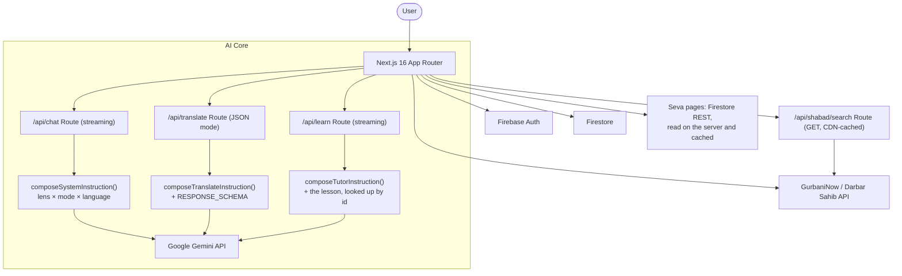

# Sikh AI: Engineering Spiritual Intelligence 🪯

[](https://nextjs.org/)
[](https://react.dev/)
[](https://firebase.google.com/)
[](https://deepmind.google/technologies/gemini/)
[](LICENSE)
[](https://sikhai.vercel.app)

> **Architecting a Modern Bridge Between Ancient Heritage and Generative AI.**

## 📖 About The Project

**Sikh AI** is a web platform designed to modernize how the Sikh community interacts with its spiritual heritage. It pairs **Google Gemini** with a carefully-tuned Sikhi system prompt and streaming responses, so answers stay rooted in the teachings of the *Sri Guru Granth Sahib Ji* rather than drifting into generic advice.

Whether it's fetching the daily *Hukamnama* from Darbar Sahib, coordinating *Seva* (community service) events, finding any Shabad of the *Guru Granth Sahib* from a line of it, typed in Gurmukhi or English letters, or translating between English and Punjabi in either script, Sikh AI aims for a calm, culturally-considered experience — now with light/dark/system theming and an accessible, mobile-friendly interface.

### 🌟 Key Features

*   **💬 Streaming, Gurbani-Guided Chat**: Responses stream token-by-token from Google Gemini (pinned to `gemini-3.8-flash`), steered by a system instruction to stay grounded in Guru Granth Sahib teachings. The answer settings — lens, style and reply language — sit as chips in the chat bar, right under the question they shape, and every answer is labelled with the settings that produced it. Every reply shows where it stands: a failed one says why in the site language and offers Retry, a reply stopped before it began says so (with Retry), and one cut short keeps its text and is marked. Asking a failed question again replaces the failed attempt instead of stacking a second copy of the question.
*   **🗂️ Past Chats & Share Links**: Every new chat starts blank; old ones stay in a sidebar (a drawer on phones), pinned first, then by day, with pin, rename and delete. Chats are saved in the browser, or — once the Firestore rules below are deployed — to the signed-in Google account, following the user across devices, with an offer to move this browser's chats over. A browser keeps up to 50 chats and an account its 100 most recently used (plus pinned ones, which never go); past that, the least recently used unpinned chat makes room, and the list says so. Moving chats from the browser stops at those older than everything a full account keeps, which stay in the browser rather than being moved only to go. A reply keeps streaming while you switch chats or visit another page of the site, and is saved to its own chat. A chat can be shared as a public, read-only snapshot link (`/share/{id}`, `noindex`), updated or withdrawn at any time; readers can continue it as a chat of their own.
*   **✅ Verified Gurbani Citations**: Every model tested misquotes Gurbani now and then — an altered word, two lines blended into one, the wrong Ang, the wrong Guru. So after each reply, the lines it quotes (the first six) are checked against GurbaniNow, and a card under the reply shows what the source actually says: the letter-perfect line, its translation, Ang, writer, and raag, with a link to open that Ang. A quote that doesn't match is flagged ("Wording differs from the source" beside the closest real line, "Found on a different Ang", "Couldn't verify this line"), and one that matches only once vowel signs are set aside says "Same line, spelled differently" — in Gurbani a lagan matra can change the meaning. When a reply quotes more than six lines, the card says how many went unchecked. The reply itself is never edited. A card's source line, translation, Ang, writer and raag all come from GurbaniNow; the reply's own wording appears only where a card labels it "In the reply".
*   **🧭 Guru Teachings-Lenses**: Ask for guidance through the lens of any of the ten Gurus (or the default SikhAI). Each lens shifts emphasis, preferred Bani, and sakhis while never impersonating a Guru — answers stay in the third person with honorifics. A switch applies from the next message, where a divider marks the change.
*   **🎛️ Response Styles & Languages**: Orthogonal to the lens, pick (from the chat bar) a response style (Balanced, Simple/newcomer, Gurbani-first, Vichaar/reflection, Sakhi/story) and a language (English, Punjabi-American bilingual, or Punjabi with Gurmukhi/romanized script-matching). All three axes are composed server-side into one Gemini `systemInstruction`.
*   **🧩 Guided Prompting**: Per-lens starter chips plus categorized topic packs (Life advice, Hardship & grief, Concepts, History & sakhis, Daily practice), and deep links from the Hukamnama and Shabad pages that open the chat with that passage attached as context.
*   **🔤 Punjabi ↔ English Translator**: Type English, Gurmukhi, or romanized Punjabi and get **all three renditions at once**, plus a word-by-word gloss, "tricky parts" notes (idioms, the ergative *ne*, honorifics, false friends), and pronunciation tips anchored to real words from the result. Input script is auto-detected and overridable. Built for diaspora learners who speak some Punjabi but may not read Gurmukhi — so it ships a 50-phrase curated phrasebook across five categories (greetings, kinship, gurdwara, everyday, food), whose results are generated ahead of time: a tap shows the full result at once, with no request, even when Gemini is down. Local history restores any past result with no re-fetch, and translating the same text again reuses it (the button then offers **Translate again** for a fresh answer). Romanization follows one house style, the way families text each other (Chacha ji, not Chaachaa ji), matching the phrasebook and the romanized-Punjabi interface. When Gemini is rate-limited, English and Gurmukhi input degrade gracefully to a clearly-labelled Cloud Translation rendering rather than an error — romanized Punjabi is the one case with no fallback, since Cloud Translation can neither read nor produce it. Full results can also be cross-checked against Google Translate on demand.
*   **🎓 Learn Punjabi**: A course for Punjabi Americans who grew up hearing Punjabi and want to read it, understand it and speak it with family. The **Gurmukhi script** track goes row by row through the alphabet, the dotted letters and digits, the ten vowels and the vowel carriers, bindi, tippi and addak, and the tones hidden in ਘ ਝ ਢ ਧ ਭ, ending on words you already know. The **grammar** track covers word order, gender and agreement, da/di/de, postpositions, the present, the past and *ne* (why it's *kita* and not *kiti*), the future, commands, questions, respect, *mainu* constructions and helper verbs. **Vocabulary** comes in ten topics (family with every aunt and uncle by side and age, the Gurdwara, food, home, numbers and time, and more), each with a word list, flashcards on a spaced-repetition schedule, and a quiz. Every lesson ends in a quiz that grades typed romanized answers leniently but always shows the house spelling. Explanations are in English; every piece of Punjabi comes as Gurmukhi, romanized Punjabi and English together, spelled the same way as the phrasebook and the translator. Progress (finished lessons, best scores, flashcard schedules) stays in the browser. The **Punjabi tutor** answers questions about any sentence, says how to say things, and runs short role plays and quizzes, correcting gently; opened from a lesson, it builds on that lesson. The content is AI-drafted and waiting for a fluent review, and each lesson file lists its open questions.
*   **⚡ Daily Hukamnama**: Server-rendered fetch of the day's decree from Darbar Sahib (via the GurbaniNow API), rendered in Gurmukhi with English translation. The decree is cached for ten minutes. A placeholder shows while it loads, and if the source is slow or down, a readable message appears within seconds instead of a hanging page.
*   **📖 Shabad Search**: Type a line of Gurbani, or part of one, and Shabad Search finds the shabads it's in — in Gurmukhi words (ਸੋ ਪੁਰਖੁ ਨਿਰੰਜਨੁ), by the first letter of each word (ਸਪਨਹ, the way Gurbani search engines are used), or in English letters as readers type them (so purakh niranjan, or spnh). GurbaniNow can't search romanized text, so the site guesses each word's Gurmukhi first letter, the likelier guesses first where English letters are ambiguous (t is ਤ, sometimes ਟ), and keeps only the lines whose own transliteration reads like what was typed: English and gibberish find nothing rather than junk. Results come one per shabad, best match first, each opening the whole shabad at `/shabad/s/{id}` with the searched line highlighted — whole even across Angs, with transliteration and translation, links to its Angs, and the shabads before and after it. A search makes at most four lookups on a daily allowance of its own (a busy day of searches can't switch off quote checking), lives in the address (`/shabad?q=…`), and its answer is kept at the CDN. Every Ang (1–1430) still has its own page, `/shabad/{n}` in each language, rendered on the server so search engines can read it, built the first time someone opens it and then served from the CDN for a month; its lines are grouped by shabad, each group leading to the whole shabad, with the Ang's own title and description, JSON-LD, previous and next links, and a button to ask SikhAI about it. The sitemap lists every Ang, and older `/shabad?ang=` links forward to the Ang's page. Sri Guru Granth Sahib Ji only, for now.
*   **🤝 Seva Events**: What's coming up, soonest first, filtered by country, city and kind of seva (the filters travel in the link, and the last country is remembered), and a page for every event, built on the server so it loads fast, previews in a shared link and can be found in search (schema.org's `Event`). Signed in, Your seva lists what you've joined and what you host, and the board marks those events' cards. Volunteers join with a name, and share an email or phone with the host only if they choose; they can leave at any time. Each event can be added to Google Calendar or any other calendar (`.ics`), shared on WhatsApp or through the phone's share sheet, and found with Google Maps. Hosts post with Google sign-in (the form can be filled in first) and choose who may sign up: anyone, up to a number, or no one, for an event that just lets the community know. They edit, cancel with a word to volunteers, see who's coming, and post the same event a week later. Visitors can report an event, and admins hide or unhide it and review reports at `/seva/admin`. No public document holds an account ID; the rules keep the count of volunteers in step with the sign-ups, and within the limit, or 500 when none is set.
*   **🎨 Accessible, Themeable UI**: A bespoke design system in "Nihang Navy" and "Kesri Saffron" with a navbar theme picker offering Light / Dark / System (no-flash pre-paint script, class-based dark mode over semantic CSS-variable tokens; System tracks the OS live, and where browsers tint their bars from `theme-color` — chiefly Chrome and Samsung Internet on Android — the tint follows the choice too), keyboard focus-visible rings, ARIA-labelled controls, `prefers-reduced-motion` support, and an AA-contrast accent token.
*   **🌐 Site-Wide Punjabi UI**: A navbar language picker — the same dropdown component as the theme picker, so both behave identically — switches the whole interface between English, ਪੰਜਾਬੀ (Gurmukhi), and romanized Punjabi. Each language has its own addresses (English at `/about`, Gurmukhi at `/pa/about`, romanized Punjabi at `/pa-latn/about`), so every page arrives already translated, straight from the CDN, and search engines can find all three. A cookie remembers the choice, so an unprefixed link opens in the reader's language next time. The `<html lang>` attribute and body font follow the script, and the chat's reply language defaults to the site language while remaining overridable from the language chip in the chat bar. All copy lives in typed dictionaries under `lib/i18n/dictionaries/` — missing translation keys are compile errors.

## 🏗️ Technical Architecture

A **Next.js 16 App Router** application (React 19, Tailwind CSS v4) that talks directly to Gemini and Firebase — no intermediate services to keep the stack lean.


```mermaid
graph TD
    User([User]) --> Next[Next.js 16 App Router]
    Next --> Auth[Firebase Auth]
    Next --> DB[Firestore]
    Next --> SevaPages["Seva pages: Firestore REST,<br/>read on the server and cached"]
    Next --> Hukam[GurbaniNow / Darbar Sahib API]
    Next --> SRoute["/api/shabad/search Route (GET, CDN-cached)"]
    SRoute --> Hukam

    subgraph "AI Core"
    Next --> Route["/api/chat Route (streaming)"]
    Route --> Compose["composeSystemInstruction()<br/>lens × mode × language"]
    Next --> TRoute["/api/translate Route (JSON mode)"]
    TRoute --> TCompose["composeTranslateInstruction()<br/>+ RESPONSE_SCHEMA"]
    Next --> LRoute["/api/learn Route (streaming)"]
    LRoute --> LCompose["composeTutorInstruction()<br/>+ the lesson, looked up by id"]
    Compose --> Gemini[Google Gemini API]
    TCompose --> Gemini
    LCompose --> Gemini
    end
```

The chat client sends only whitelisted IDs (`lensId` / `modeId` / `languageId`, plus an optional `script` hint) and an optional reference passage — never prompt text. The route validates each value, silently falls back to defaults on anything unknown, and assembles the persona server-side in `lib/chat/`, so prompt fragments never ship to the browser and can't be tampered with from the client.

### Engineering Highlights
*   **Hybrid Rendering**: React Server Components for static/data-fetched content (the server-rendered Hukamnama and every Ang's page) with Client Components for the interactive AI chat.
*   **Streamed Responses**: The chat API returns a raw `text/plain` `ReadableStream`, so tokens render as they generate — minimizing time-to-first-token. The mechanics (reading past the signature-only first chunk to the first text, a JSON error for a refused or empty reply, erroring the body when a reply is cut short, stopping Gemini when the reader leaves) live in `lib/gemini/stream.ts`, shared with the Punjabi tutor's `/api/learn`. The chat page redraws at most once per animation frame, and only the reply that is streaming redraws: the replies above it are memoized, and the streaming one is cut into Markdown blocks (`lib/chat/markdownBlocks.ts`), so each new piece re-parses only its unfinished end. `MOCK_LONG` in the Gemini mock streams a 12,000-character answer in small pieces to profile this.
*   **Schema-constrained JSON output**: The translator uses Gemini's `responseMimeType: 'application/json'` + `responseSchema`, with the schema enums generated from the same `as const` unions as the TypeScript types so the two can't drift. The response is then re-validated at runtime in `lib/translate/parse.ts` — malformed list entries are dropped rather than failing the whole translation, and a truncated response is caught via its `MAX_TOKENS` finish reason instead of surfacing as a JSON parse error.
*   **Pinned models, not aliases**: Every Gemini call names a specific stable model, set in one place (`lib/gemini/models.ts`) with a per-feature env override (`GEMINI_CHAT_MODEL`, `GEMINI_TRANSLATE_MODEL`, `GEMINI_LEARN_MODEL`). Google hot-swaps the `gemini-flash-latest` alias on each release, so the model behind the prompts could change with no code change; pinning makes upgrades deliberate, and the override lets a preview deployment try a model first. Every route sets `thinkingLevel: LOW` and no sampling temperature, per Google's Gemini 3.x guidance, with the translator's fidelity rules stated in its system prompt instead.
*   **Failure you can read**: When the pinned model is overloaded, rate-limited, unavailable, or silent too long (10 s to the chat's first word, 8 s to the tutor's, 12 s for a translation), each route tries one fallback model (`gemini-3.7-flash`; `GEMINI_CHAT_FALLBACK_MODEL` / `GEMINI_TRANSLATE_FALLBACK_MODEL` / `GEMINI_LEARN_FALLBACK_MODEL`, `off` to disable) — but never for a rejected request, a bad key, or an empty prepaid balance, which fail the same everywhere. Every route runs on a time budget inside the 30 s function limit, so the translator's Cloud fallback always gets its turn. The chat and the tutor read their stream up to the first word before answering, so a refused prompt gets a proper "couldn't respond" message and an overloaded service a "busy" one — never the browser's raw network error. A reply cut short by a filter or the output cap (4,096 tokens for the chat, 1,536 for the tutor) keeps its text and is marked interrupted rather than passed off as complete, and in the chat the quotes that did arrive are still checked. Every Gemini call writes one JSON log line (model served, fallback depth, latency, tokens, how many prompt tokens Gemini's implicit cache served, outcome — never message text). Every line an API route writes, from the Gemini client, GurbaniNow or Cloud Translation too, carries the request's ID (Vercel's own `x-vercel-id`, as in its request log) and route (`lib/log.ts`), and a route's unexpected error adds the top of its stack trace. So one visitor's failure can be followed through the logs.
*   **Checking quotes without trusting the model** (`lib/gurbani/`): the verifier pulls quoted Gurmukhi out of a reply (in a Punjabi reply, only lines closed by `॥`; never greetings, raag headings, or the reply's own commentary introduced as ਅਰਥ: or ਭਾਵ:, which teeka style also closes with the verse number) and pairs each with the Ang the reply cites. It reads that Ang first — a match there costs no search — then falls back to GurbaniNow's first-letter search, mapping vowel-initial words to the carrier letters (ੲ ੳ ਅ) the index files them under. A quote verifies only when every word appears, in order, in one real line. Words are compared by their letters alone (vowel signs, vowel length and nasal marks are ignored), so a spelling slip (ਪਸਾਊ for ਪਸਾਉ) still matches and is flagged as a spelling difference, while a word swapped for one with different letters, or truncated, does not. When the source can't be reached, the quote simply gets no card — silence is never reported as a misquote. The tests replay real GurbaniNow answers recorded by `npm run fixtures:gurbani` (`-- --only verify|shabad|search` re-records one set: the quote checker's lookups over 18 real model replies, whole shabads, or Shabad Search's lookups for the searches in `tests/gurbani/search-fixtures.ts`; it paces itself, since GurbaniNow turns away bursts). The few hand-written test replies must quote the recorded source letter for letter, and a test holds them to it. Shabad Search compares the lines it finds with the same Gurmukhi utilities, which the Shabad identification work shares too.
*   **Chat history that can't lose a question** (`lib/chat/`): a conversation is a list of exchanges — one question and exactly one reply, whose state is `streaming`, `done`, `interrupted`, `stopped` or `error` (stored as a code and worded on screen) — so an unanswered question can't be represented. Everything read from storage goes through one `normalizeTranscript`, which validates it and repairs what the old single-chat format could hold (the same failed question stored twice becomes one question you can retry). Replies stream in a runtime outside React, keyed by attempt, so a late write from a replaced attempt can't overwrite the new one (a new attempt always starts after the one it replaces, whatever a device's clock says, and the account's rules refuse an older attempt too); it checkpoints a reply while it streams (every second in the browser, every five to Firestore), and a browser chat is flushed on `pagehide` too, so a reload mid-answer keeps what arrived (an account chat keeps what reached its last checkpoint). The chat screen lives in `app/[lang]/chat/layout.tsx` and follows the URL (`/chat`, `/chat/{id}`, under the language's prefix) through `pushState`/`replaceState`: a layout is never remounted, so switching chats can't reset a conversation mid-reply. Switching the site's language loads the page afresh, and a reply still streaming is saved as far as it got. Two stores keep one contract — `localStorage` (one key per chat, least-recently-used eviction when full, never pinned or open chats) and Firestore (`users/{uid}/chats/{chatId}` plus one document per exchange; writes apply locally at once and sync in the background). Their pure parts — send and retry plans, the reply state machine, Firestore write plans, share snapshots — are unit-tested.
*   **Lessons as reviewable data** (`lib/learn/`): each lesson and vocabulary topic is a typed file with its open questions for a fluent reviewer at the top, joined on the server (`lib/learn/curriculum.ts`), so a page ships only its own lesson's quiz and never the course. Every lesson and topic page is built ahead of time in all three languages; an unknown one gets the site's 404. `tests/learn/content.test.ts` holds the content to its contract: complete parallel text, Gurmukhi that is only Gurmukhi, romanization in the house style, answerable quizzes, and one spelling per word across the lessons, the vocabulary and the phrasebook. Flashcards follow a six-box Leitner schedule (`lib/learn/srs.ts`), typed answers are graded leniently but never by "close enough", and strictly where a script question tests vowel length or addak (`lib/learn/quiz.ts`), and progress is read back through a parser that never throws (`lib/learn/progress.ts`). Each change is written to the saved copy as it stands, so a stale tab can't erase what another saved. The tutor's conversation lasts as long as the tab (sessionStorage), and a reply cut off by a reload is marked so.
*   **Server-only prompts + nonce fencing**: The chat, translate and tutor system prompts live in server-only modules, so prompt text never ships to the browser. The translator and the tutor share one set of house romanization rules (`lib/translate/romanization.ts`), so both spell romanized Punjabi the way the phrasebook and the lessons do. Text from outside that a prompt quotes is wrapped in a per-request UUID-nonce fence, so crafted input can't forge the closing delimiter and break out into instructions: the passage a chat is opened from, in the chat's system instruction, and the text sent to the translator, in the user message, which the translator's instruction calls data. The tutor's page sends a lesson as an id only; the route looks the lesson up in the site's own curriculum, and since that text is the site's own, its fence is fixed, which keeps the instruction the same from turn to turn for Gemini's implicit cache. Chat and tutor messages go to Gemini as conversation turns, not instructions.
*   **Theming without flash**: An inline pre-paint script applies the stored choice before first paint. `<html class="dark">` drives the CSS, while `<html data-theme>` records which of Light / Dark / System the user picked — the class alone can't distinguish light-because-chosen from light-because-the-OS-says-so. Semantic `@theme inline` tokens drive both modes, and the picker reads the attribute back through a `MutationObserver`, so it stays correct no matter what changes it. The same script writes the page's one `<meta name="theme-color">`, which only `lib/theme.ts` manages: Next's `viewport` export deliberately emits none, because React hydrates a `<meta>` by claiming any existing one with the same name and content, and a second writer gets mistaken for it. Once hydrated, `watchTheme()` re-applies the stored choice (it may have changed in another tab while the page loaded, or a failed hydration may have wiped `<html>`'s attributes), then follows the OS under System and other tabs through the `storage` event. The picker's own icon and accessible name are chosen in CSS from `data-theme` with Tailwind's `in-data-[theme=…]:` variant, so they are right before hydration too.
*   **A language per URL, every page built ahead of time, no library**: Pages live under `app/[lang]` and are built once per language (`generateStaticParams`), so each one comes from the CDN already translated, with no per-visit render. English keeps the site's original, unprefixed addresses: a `next.config` rewrite serves `/about` from `/en/about`, and `/en/…` redirects away (`lib/i18n/routing.ts`). A `sikhai.lang` cookie remembers a Punjabi reader's choice, and a cookie-conditioned redirect sends them from an unprefixed page to its `/pa` or `/pa-latn` twin. Both run in the host's routing layer, before its cache, so no function runs to route a request. Each page lists its twins as hreflang alternates, and so does the sitemap. Links are built with `localePath()` / `useLocalePath()` (`lib/i18n/paths.ts`). A 404 is `app/global-not-found.tsx`: one static page carrying all three languages, where a pre-paint script picks the reader's from the address. The exception is a language prefix in the wrong case (`/PA/about`): the host matches the routing rules regardless of case, so that address reaches `app/[lang]`, whose layout answers a language it doesn't know with Next's plain 404. UI copy is typed dictionaries in `lib/i18n/dictionaries/` (`Dictionary = typeof en`, so missing keys are compile errors), read via `useT()` in client components and `getServerT()` on the server, which reads the language from the URL through `next/root-params`. Every page's script carries all three dictionaries, so the long words of `/privacy` and `/terms` live apart, in `lib/i18n/policy/`, read only by those two pages' server components; so do the words of removing what the site keeps (`lib/i18n/account/`), which `/privacy` passes to its controls and the Delete account dialog loads with its own code.
*   **Multilingual typography**: Geist / Geist Mono for Latin text and Noto Sans Gurmukhi for Gurmukhi script, wired through Tailwind v4 font tokens (`app/fonts.ts`); an `html[lang='pa']` rule swaps the body stack to Gurmukhi automatically when that language is active. Geist Mono is not preloaded, because the only monospace text is code in chat replies, so a page downloads it only when it shows some.
*   **Light pages, clear previews**:
    *   The navbar, footer and home page links prefetch only on hover, focus or touch (`app/components/IntentLink.tsx`), so a visit doesn't download every page in view for a click that might never come.
    *   Firebase loads only where it's used (`lib/firebase/`). Firestore ships with shared chats and account chats. Seva's pages are built on the server from Firestore's REST API, so viewing events loads no Firebase at all; joining, hosting and reporting load Firestore Lite on demand, as does deleting an account, once it's confirmed. Auth, about 50 KB, loads straight away only in a browser that was signed in last time (a hint in `localStorage`, copied onto `<html data-auth>` before first paint so "Sign in" never flashes up), and otherwise as the pointer, focus or a finger reaches a sign-in button. The home page, which doesn't use Firebase, went from about 304 KB of script to 178 KB (gzipped).
    *   Every route sends the standard security headers (`next.config.ts`), and none sends `X-Powered-By`. A Content-Security-Policy (`lib/csp.ts`) is enforced: browsers block whatever it doesn't allow and post each block to `/api/csp-report`, which logs a `csp_violation` line (directive, blocked origin, page path). A feature that loads from a new host has to add it there. In the chat, a Markdown image shows as a link to it, so nothing in an answer loads from another site. Scripts keep `'unsafe-inline'`, because Next sends each page's data in inline scripts and a per-request nonce would make every page dynamic, so the policy guards where scripts, frames and connections come from and who may frame the site.
    *   The AI routes, the quote check and Shabad Search turn away what the site's own pages wouldn't send, before it costs anything (`lib/api/`). A request from another site's page is refused by its `Sec-Fetch-Site` header (403), and so is a POST that isn't JSON (415), since a page elsewhere can't send JSON without a preflight, which Next answers without CORS headers. A body larger than a real client can send gets a 413. Past those, each running server counts each visitor's requests, per minute and per UTC day (`lib/api/allowance.ts`: the chat and the tutor 10 and 300, the translator 15 and 300, Shabad Search 20 and 300, the quote check 10 and 100, Compare 5 and 50), and answers a 429: the feature's "busy" message past the minute, "come back later" past the day. A visitor is the address Vercel reports, or an IPv6 address's /64, held only as a code made with a secret that changes every day. Servers don't share their counts, so this backs up the firewall's rate limit (Running in production, step 3) rather than replacing it. A refusal writes a `request_refused` or `visitor_limited` line, at most one a minute per route and reason with a count of the rest, never the address.
    *   Each page builds its own description, link preview, canonical URL and language alternates (`lib/metadata.ts`), because Next replaces a parent's `openGraph` rather than merging it.
    *   Crawlers get `robots.txt` and `sitemap.xml`.
    *   A failure in the root layout itself gets a translated, themed page (`app/global-error.tsx`) rather than Next's bare default.
    *   The site installs as an app on a phone: `app/manifest.ts`, and icons that are the navbar's ੴ in the site's own Gurmukhi font (`public/icon-*.png`, `app/apple-icon.png`).
    *   `/privacy` and `/terms` say, in all three languages, what the site keeps, where, for how long, what it sends to which service and how to remove it, and the few rules for using it (the AI features are for people 18 and over, as Gemini's terms require). Both render through `app/components/PolicyPage.tsx`, a server component, from sections kept in `lib/i18n/policy/` and keyed by id, so each is an anchor (`/privacy#analytics`) and the words ship only with those two pages. The limits they state are placeholders filled from the constants the code enforces (`lib/policy.ts`), and a test fails on any a page doesn't fill; the contact address is one constant (`lib/site.ts`). Visits are counted by Vercel Web Analytics, on the production deployment only, and page speed by Speed Insights: both are Vercel's own, set no cookies and load from this site. Neither counts a visitor who switches counting off on `/privacy` or whose browser sends Global Privacy Control, and every address they record has a share link's or chat's ID, query and fragment taken out (`lib/analytics.ts`).
    *   Anyone signed in deletes their own account, from the account menu in the navbar or from `/privacy#removing`: Google confirms it's them, then their browser takes apart everything the account keeps, under the Firestore rules and with the app's own write plans (`lib/account/deletion.ts`, run on the emulator by `tests/rules/account.rules.ts`), and deletes the account last; reports it sent stay for the admins. Share links name no account: who made one is a note only its owner can read (`users/{uid}/shares`). Anyone can clear everything the site keeps in their browser from `/privacy`, which keeps only a choice not to be counted (`lib/browserData.ts`).

## 🚀 Getting Started

Follow these steps to set up the project locally.

### Prerequisites

*   Node.js 24, the version in `.nvmrc` and in `package.json`'s `engines`, which CI and Vercel both use. Newer versions work but make npm print an `EBADENGINE` warning; 20 is too old for the test script's quoted glob.
*   npm or yarn
*   A Firebase project (Auth + Firestore)
*   A Google Gemini API key ([Google AI Studio](https://aistudio.google.com/))

### Installation

1.  **Clone the repository**
    ```bash
    git clone https://github.com/rohan1234usa/sikh-ai.git
    cd sikh-ai
    ```

2.  **Install dependencies**
    ```bash
    npm install
    ```

3.  **Set up Environment Variables**
    Create a `.env.local` file in the root directory:
    ```env
    # Google Gemini (server-side)
    GEMINI_API_KEY=your_gemini_key
    # Optional per-feature model overrides (defaults are pinned in
    # lib/gemini/models.ts). Must be Gemini 3.x models. On the free tier,
    # giving the translator its own model also gives it its own daily quota.
    # GEMINI_CHAT_MODEL=gemini-3.8-flash
    # GEMINI_TRANSLATE_MODEL=gemini-3.6-flash
    # The one model tried when the pinned one is overloaded or down
    # (default gemini-3.7-flash); "off" disables the fallback.
    # GEMINI_CHAT_FALLBACK_MODEL=off
    # GEMINI_TRANSLATE_FALLBACK_MODEL=gemini-3.6-flash
    # The Punjabi tutor (/api/learn) has its own pair.
    # GEMINI_LEARN_MODEL=gemini-3.8-flash
    # GEMINI_LEARN_FALLBACK_MODEL=gemini-3.7-flash

    # Google Cloud Translation (server-side, optional)
    # Powers the translator's fallback when Gemini is unavailable, the
    # "Compare with Google Translate" cross-check, and the i18n audit script.
    # Each running server allows the fallback 10,000 characters a day, and
    # the cross-check its own 10,000, so one can't use up the other's.
    # Must be a key with the Cloud Translation API enabled — a Gemini key
    # restricted to the Generative Language API returns 403.
    GOOGLE_TRANSLATE_API_KEY=your_translation_key
    # Set to "off" to disable every runtime Cloud Translation call.
    # TRANSLATE_FALLBACK=off

    # Firebase (client-side)
    NEXT_PUBLIC_FIREBASE_API_KEY=your_api_key
    NEXT_PUBLIC_FIREBASE_AUTH_DOMAIN=your_project.firebaseapp.com
    NEXT_PUBLIC_FIREBASE_PROJECT_ID=your_project_id
    NEXT_PUBLIC_FIREBASE_STORAGE_BUCKET=your_project.appspot.com
    NEXT_PUBLIC_FIREBASE_MESSAGING_SENDER_ID=your_sender_id
    NEXT_PUBLIC_FIREBASE_APP_ID=your_app_id
    # Saved chats in the signed-in account, and share links. Leave unset
    # until the chat rules are in (Running in production, step 5): chats
    # are then kept in the browser only. Or set it with the emulators to
    # try them locally (Testing Seva locally).
    # NEXT_PUBLIC_CHAT_CLOUD=1
    ```

4.  **Run the dev server**
    ```bash
    npm run dev
    ```

5.  **Run the tests**
    ```bash
    npm test
    ```
    Node's built-in test runner via `tsx`; no extra dependencies. The route tests call the real `POST` handlers against a local mock of the Gemini API (`scripts/mock-gemini.ts`), so they need no key and cost nothing. The same mock lets you drive the app by hand without spending anything: run `npm run mock:gemini`, then start the app with `GOOGLE_GEMINI_BASE_URL=http://127.0.0.1:8787 GEMINI_API_KEY=mock TRANSLATE_FALLBACK=off npm run dev`, and put a trigger word such as `MOCK_429` or `MOCK_BLOCKED` in a message (the full list is at the top of the script).

6.  **Run what CI runs**
    ```bash
    npm run typecheck && npm run lint && npm test
    ```
    On every pull request and every push to `main`, [CI](.github/workflows/ci.yml) runs these three, the Firestore rules tests on the emulator (`npm run test:rules`, which needs Java 21), the i18n audit's dry run (whose committed report must not change), and a build. It runs with placeholder keys, so it needs no secrets and costs nothing. A pull request can merge into `main` only once CI passes.

### Running in production

Four settings outside the code keep a public deployment affordable and safe, a fifth turns on saved chats and share links, and a sixth sets up Seva events:

1.  **Billing on the Gemini key's project.** In AI Studio → API keys, find the project behind the production key and set up billing. A small prepaid balance with auto-reload off caps the worst case at that balance. When it runs out, Gemini answers HTTP 402: the chat shows its "busy" message, and the translator falls back to Cloud Translation where it can. Keep billing on: `/privacy` tells visitors the site uses Gemini's paid service, under which Google doesn't use what it's sent to improve its products, and Gemini's terms allow only the paid service for visitors in the EEA, Switzerland and the UK.
2.  **A monthly spend cap** (AI Studio → Spend). Enforcement lags by about ten minutes.
3.  **One rate-limit rule** (Vercel → Firewall; the Hobby plan allows one): path starts with `/api/`, method POST, 20 requests per IP in a 60-second fixed window. Leave out `/api/csp-report`, where browsers post policy reports, so they never count against a visitor's chat. Run it in Log mode for a week, then switch it to 429. The rule's action is Rate limit either way. What changes is its action past the limit: `log` while it only logs, then `rate_limit`, a 429 (`deny` would answer 403 instead). The chat, the translator and the tutor already show their "busy" message for the firewall's 429. Shabad Search's `/api/shabad/search` is a GET, so add it to the same rule with OR (a rule can join its conditions with OR). Without it, scripts on a few addresses could spend Shabad Search's daily allowance of GurbaniNow calls (5,000 per running server, at least 1,250 searches; one address can use at most 1,200 a day), and search would say it's busy until the next UTC day. Quote checking has its own allowance and keeps working. Shabad Search shows its own "busy" message for the 429. The routes also count each visitor themselves (`lib/api/allowance.ts`), so even while the rule only logs, one address can't keep a feature busy all day; but each running server counts on its own, and only the firewall counts across them and stops a flood before any function runs. A change to the rule is a draft until it's published. To check it from a terminal:
    *   `npx vercel@latest firewall diff --project <project>` should show nothing waiting to publish.
    *   `npx vercel@latest firewall rules inspect <rule> --project <project>` should show its action past the limit as `rate_limit`, not `log`. `rules list` shows drafts too.

    To check what it does, run `npm run check:limits -- --bursts` (`scripts/limits-check/`). It sends bursts that cost nothing and expects the firewall's 429 on them. It takes about seven minutes, and afterwards the site answers your address with a 429 for up to a minute. Without `--bursts`, it checks only the refusals, with four requests.
4.  **Restrict the Gemini key** to the Generative Language API, but only after `GOOGLE_TRANSLATE_API_KEY` is set on its own. Until then Cloud Translation borrows the Gemini key, and restricting it would quietly break the translator's fallback.
5.  **Saved chats in the account, and share links** (off until you do this; chats stay in the browser meanwhile):
    1.  Deploy [`firestore.rules`](firestore.rules) and its indexes, as in step 6. Rules are OR-ed, so a catch-all left in the console (`match /{document=**}`, `allow read, write: if true`, or a test-mode `request.time < …` rule) would expose every saved chat; deploying the whole file replaces them.
    2.  Check it in the Rules Playground: a user can read their own chats but not another's; anyone can `get` a `shared_chats` document but no one can `list` them; no one can read another account's `users/{uid}/shares`.
    3.  `shared_chats` should be empty. Anything there came from trying share links on a preview with an earlier build, in a shape that names the account, and its owner can no longer end it. Delete it all: `npx firebase-tools@15.32.0 firestore:delete shared_chats --recursive --project <project-id>`.
    4.  Set `NEXT_PUBLIC_CHAT_CLOUD=1` in Vercel (try a preview first, with its domain added to Firebase Auth's authorized domains) and redeploy. Add a Firestore budget alert: rules can't cap how much a signed-in user stores.

6.  **Seva events** (the new board and pages, and Delete account, need these before they can write):
    1.  Export the console's Firestore rules and compare them with [`firestore.rules`](firestore.rules): anything they allow that the file doesn't would stop working once it's deployed.
    2.  Make yourself an admin: Firebase console → Authentication → Users, copy your User UID; then Firestore → Start collection `admins` → document ID: that UID, any field (say `role: "owner"`).
    3.  Deploy the board's index first and wait until it shows Enabled: `npx firebase-tools@15.32.0 deploy --only firestore:indexes --project <project-id>` (answer No if asked to delete indexes it doesn't know).
    4.  Delete any events from before (they have a free-text `date` and an `attendees` list of account IDs; the new pages can't read them).
    5.  Deploy the rules, `npx firebase-tools@15.32.0 deploy --only firestore:rules --project <project-id>`, and promote the deployment with the new pages straight after: the old Seva page can't read or write under the new rules.
    6.  Try it with two accounts: post an event, join it from the other sharing an email, see the volunteer under the host's Volunteers, leave, report it, hide and unhide it at `/seva/admin`, dismiss the report, cancel it. Then delete the account that posted it, from its account menu, which winds the event down under the deployed rules (not your admin account: `admins/{uid}` stays, and a new sign-in gets a new ID). Or delete the event with `firestore:delete seva_events/<id> --recursive`, and `users/<uid>/seva_hosting/<id>` with it.
    7.  Server pages read events through Firestore's REST API without a key, as any visitor would: if App Check enforcement is ever turned on for Firestore, they stop working.

**The Firestore rules** live in [`firestore.rules`](firestore.rules): the whole file, reviewed in pull requests and tested on the emulator (`npm run test:rules`, which needs Java 21; CI runs it), with the indexes the queries need in [`firestore.indexes.json`](firestore.indexes.json). `firebase deploy --only firestore:rules,firestore:indexes` replaces every rule in the console, so before the first deploy, export the console's rules and compare them with the file: anything they allow that the file doesn't would stop working. After that, deploy only from the file, never a part of it pasted into the console. When a change lets the app write something new, deploy the rules before the code that writes it. Don't roll the rules back once such documents exist. For example, events with no set limit on sign-ups (`spots: null`, which still stop at 500), or with no sign-up at all (`spots: 0`), need these rules: under older rules their hosts couldn't edit, cancel or delete them.

**Moderating Seva events.** An account with a document in `admins/` (made in the console, step 6.2) sees reports at `/seva/admin`, hides or unhides an event there or on its page, and dismisses reports once dealt with (which deletes them). A hidden event leaves the board and its page says it isn't available; its host still sees it. To delete an event for good, use `npx firebase-tools firestore:delete seva_events/<id> --recursive --project <project-id>`: a plain delete leaves its sign-ups behind. Its host's note (`users/<host uid>/seva_hosting/<id>`) stays too, unseen, and still makes them host of anything later posted at that id: delete it when you know the host. The volunteers' own notes of it then show "removed" in their Your seva list, where they can clear them. Hosts delete events only by deleting their account: the rules let a host delete an event once it's cancelled or over, and the app clears its sign-ups first.

**Before `/privacy` and `/terms` go live:**
1.  **Set `CONTACT_EMAIL`** in `lib/site.ts`. Until then it's a placeholder at `example.invalid`, which `npm test` lists as a TODO. Use an inbox someone reads: the pages promise a reply, and that a deletion is done within 30 days.
2.  **Google sign-in's branding** (Google Cloud console for the Firebase project → Google Auth Platform → Branding): home page `https://sikhai.vercel.app`, privacy policy `https://sikhai.vercel.app/privacy`, terms `https://sikhai.vercel.app/terms`. Google asks for a privacy policy on the app's own domain that says how it uses Google user data, which `/privacy` does.
3.  Whenever what a page says changes, move its date in `lib/policy.ts` (`PRIVACY_UPDATED`, `TERMS_UPDATED`); every language shows it.

**Deleting an account, or an event, by hand.** Anyone signed in deletes their own account from the account menu or `/privacy`: their share links, the events they host (cancelled, cleared of sign-ups, then deleted), their sign-ups, their chats and notes, then the account. Reports they sent stay for the admins. It runs in their browser under the deployed rules (step 6), so until those are live it stops with an error and nothing is lost. The pages still offer deletion by email, within 30 days, for someone who can't sign in or wants one event deleted; anyone can leave an event themselves, from its page. For a request:
1.  Reply to confirm the request came from the account's own email address.
2.  Firebase console → Authentication → Users: search for the address and copy the User UID.
3.  Seva first, while the account's own notes still say what it did: for each `users/<uid>/seva_signups/<eventId>`, its `volunteerId` names the sign-up; delete `seva_events/<eventId>/volunteers/<volunteerId>` and subtract 1 from that event's `volunteerCount` (unless the event is gone). For each `users/<uid>/seva_hosting/<eventId>`, delete the event with `npx firebase-tools firestore:delete seva_events/<eventId> --recursive --project <project-id>`. In `seva_reports`, delete the documents whose ID ends `_<uid>`. For a request about one event only, delete just that event, recursively, and `users/<uid>/seva_hosting/<eventId>`, then stop.
4.  Share links next, while the account's notes still name them: each document in `users/<uid>/shares` is named after one of its links; delete `shared_chats/<that id>`. A link that's left still opens.
5.  Delete the account's chats and notes with `npx firebase-tools firestore:delete users/<uid> --recursive --project <project-id>` (each chat's `entries` go with it), then check in Firestore that `users/<uid>` is gone.
6.  Authentication → Users: delete the user, last, since the UID is how everything else is found.
7.  Reply that it's done. Mention that chats, translations and settings in their own browser stay until they clear them (Clear this browser, on `/privacy`), and that Google clears its backups within 180 days.

Four more, for seeing how the site does:
*   **Web Analytics** (Vercel → Analytics → Enable), before deploying the code that uses it: Vercel adds its routes at the next deploy, and until then the script isn't found. It counts visits on the production deployment, without cookies. The Hobby plan counts 50,000 events a month and keeps a month of reports; when a month's events run out, counting pauses (after three days' grace) rather than costing anything. To check it, open the site in an ordinary browser (automated ones aren't counted): each page sends a POST to `/<random>/view`, and on a share link its `o` ends in `/share/:id`.
*   **Speed Insights** (Vercel → Speed Insights → Enable): real visitors' Core Web Vitals. The page already includes it on Vercel. It sets no cookies and loads nothing from a third party. The free tier counts 10,000 events in 30 days (a page load sends a few), then pauses for at least 14 days; a `sampleRate` on `<SpeedInsights>` (`app/components/SiteAnalytics.tsx`) would measure a share of visits instead.
*   **The Content-Security-Policy** is enforced. After a deploy that changes what the pages load, open Logs in Live mode, search for `csp_violation`, and go through the site, including a sign-in. The Hobby plan keeps runtime logs for an hour, so lines from earlier are gone. A line means something was blocked. Add its host to `lib/csp.ts` only if the site itself means to load from it, such as a Google, Firebase or Vercel service it uses. Leave everything else blocked: a browser extension's own code, another site trying to frame this one, or anything that shouldn't be on the page. To stop blocking while you look into one, roll back the deploy, or rename the header in `next.config.ts` to `Content-Security-Policy-Report-Only`.
*   **Abuse.** A refused request writes a `request_refused` line (another site's page, or a post that isn't JSON) or a `visitor_limited` one (a visitor past a limit), at most one a minute per route and reason, with `refused` counting the rest. Firewall → Traffic shows the addresses the rate limit stopped. The sign of abuse none of this stops is Gemini spend climbing in AI Studio with no rise in visits: many addresses, each under its limits. The next step then is Vercel BotID, whose Basic check is free on Hobby and invisible to visitors: `npm i botid`; wrap `next.config.ts` in `withBotId` (its rewrites have to come before the language rewrites, and its path has to stay out of the language redirects in `lib/i18n/routing.ts`); call `initBotId({ protect: [...] })` for the AI routes in a new `instrumentation-client.ts`; call `checkBotId()` after `refuseCrossSite` in each of them and answer a bot with 403; add a line to `/privacy`; and try it on a preview deployment, since it lets everything through locally.

**If a page keeps failing while GurbaniNow is up**, purge the data cache. It keeps any answer GurbaniNow sent with HTTP 200 for a month, even one the site can't read, and it outlives deploys, so one bad answer can keep an Ang or shabad page on its error page, or a search saying it didn't finish. Purge it from the project's CDN → Caches → Purge cache → All content → Runtime and Data Cache. On Hobby the data cache is shared by every project in the team, so this empties theirs too.

### Testing Seva locally

Seva's pages read and write a Firebase project, so try them against the emulators, never the real one:

```bash
npm run emulators
```

In another terminal, `npm run seed:seva` fills them with four accounts (hana hosts every event, amar and bina volunteer, olive is an admin) and an event in every state: under way, full, cancelled, hidden, past, multi-day, one in Gurmukhi, one with no limit on sign-ups and one that takes none. Then run `next dev` with `NEXT_PUBLIC_FIREBASE_EMULATORS=1`, `NEXT_PUBLIC_FIREBASE_PROJECT_ID=demo-sikhai`, `FIRESTORE_EMULATOR_HOST=127.0.0.1:8080` and placeholder values for the other `NEXT_PUBLIC_FIREBASE_*` settings. Sign in from the emulator's own Google page, or, for a browser that can't keep its popup's opener, call `emulatorSignIn('amar')` in the console once Auth has loaded (hovering over or tabbing to Sign In loads it). `npm run a11y:prepare` copies axe-core to `public/__dev/` (ignored by git) for checking pages under `next dev`.

The same setup runs account chats, share links and Delete account. Add `NEXT_PUBLIC_CHAT_CLOUD=1` for chats and links; the seed makes none, so make them in the app. Without that flag, Delete account still runs, and its dialog leaves out links and chats. On the emulators it confirms with the account's fake Google credential (`lib/firebase/auth.ts`), so Google's popup can only be tried on a real project. Signed in as hana, deleting the account from `/privacy` winds down every seeded event.

## 💻 Usage Examples

### 1. The Hukamnama Fetcher (Server-Side)
A server component renders the daily decree through the same GurbaniNow client that checks the chat's quotes. The Hukamnama is kept for ten minutes, so repeat visits don't wait on the source. `app/[lang]/hukamnama/loading.tsx` draws the page's shape meanwhile, and a source that is slow or down becomes a readable message rather than a hanging page.

```typescript
// lib/gurbani/gurbaninow.ts
export async function fetchHukamnamaPayload(): Promise<unknown | null> {
  const data = await request(`${BASE}/hukamnama/today`, HUKAMNAMA_REVALIDATE_SECONDS); // 10 minutes
  const lines = obj(data).hukamnama;
  return Array.isArray(lines) && lines.length > 0 ? data : null; // null: no usable answer
}

// Inside request(): a 3.5 s limit and the host's data cache. It never throws.
const res = await fetch(url, {
  signal: AbortSignal.timeout(TIMEOUT_MS),
  next: { revalidate, tags: ['gurbaninow'] },
});
```

### 2. The Streaming Chat Route
The chat endpoint composes a persona from the selected lens, style, and language, applies it as Gemini's native `systemInstruction`, then streams the output back as `text/plain`. The request itself is built by `buildChatRequest()` in `lib/chat/request.ts`, shared with the tests so they exercise exactly what production sends. The streaming itself lives in `lib/gemini/stream.ts`, which the Punjabi tutor's `/api/learn` uses too.

```typescript
// app/api/chat/route.ts
const input: ChatInput = {
  message,
  history: toChatHistory(history),                              // last 10 turns, each capped
  lensId: isLensId(lensId) ? lensId : DEFAULT_PREFS.lensId,     // whitelisted; else default
  modeId: isModeId(modeId) ? modeId : DEFAULT_PREFS.modeId,
  languageId: isLanguageId(languageId) ? languageId : DEFAULT_PREFS.languageId,
  script: isScript(script) ? script : undefined,                // Gurmukhi/romanized hint from the site language
  context: sanitizeContext(context),                            // optional deep-linked passage
};

// Pinned model first; one fallback model only for capacity failures.
const { model, depth, value: opened } = await withModelFallback(
  'chat',
  model => openTextStream(ai, buildChatRequest(model, input), {  // reads up to the first text
    signal: req.signal, deadline, firstTextMs: CHAT_FIRST_TEXT_MS,
  }),
  { signal: req.signal, deadline },
);
if (opened.kind !== 'text') {                                   // JSON error, never a broken stream
  return settleNoText(opened, { feature: 'chat', model, depth }) === 'blocked' ? blocked422 : failed502;
}
return textStreamResponse(opened, { feature: 'chat', model, depth }, req.signal);

// lib/gemini/stream.ts — the body streams each piece as it comes, errors
// itself when a filter or the output cap cut the reply short, and aborts
// Gemini when the reader leaves (Stop).
const stream = new ReadableStream<Uint8Array>({
  async start(controller) {
    controller.enqueue(encoder.encode(text));
    for await (const chunk of chunks) {
      if (chunk.text) controller.enqueue(encoder.encode(chunk.text));
    }
    controller.close();
  },
  cancel() { upstream.abort(); },
});
```

### 3. The Translator Route (Structured JSON)

The translator needs three renditions, a word gloss, notes, and pronunciation tips as *data*, so it constrains decoding with a schema instead of streaming prose — then re-validates the result server-side.

```typescript
// lib/translate/prompts.ts — shared by the route and the eval script
export function buildTranslateRequest(model, text, opts): GenerateContentParameters {
  return {
    model,
    contents: buildUserMessage(text),                      // nonce-fenced
    config: {
      systemInstruction: composeTranslateInstruction(opts),
      responseMimeType: 'application/json',
      responseSchema: RESPONSE_SCHEMA,                     // enums derived from the TS unions
      maxOutputTokens: 8192,                               // includes thinking tokens
      thinkingConfig: { thinkingLevel: ThinkingLevel.LOW },
    },
  };
}

// app/api/translate/route.ts
const { value: result } = await withModelFallback(
  'translate',
  model => ai.models.generateContent(withTransport(         // abort signal + per-attempt timeout
    buildTranslateRequest(model, text, { sourceHint: hint, detectedScript }),
    { signal: req.signal, timeoutMs: Math.min(12_000, deadline - Date.now()) },
  )),
  { signal: req.signal, deadline },                        // 20 s for Gemini, leaving Cloud its turn
);
const parsed = parseTranslationResult(result.text ?? '', fallbackDetected);
if (!parsed) return cloudFallbackOr(502, 'translate_failed');
```

## 🔍 i18n Audit Script

The Punjabi dictionaries and the translator's phrasebook are AI-drafted and flagged pending review by a fluent speaker. `npm run audit:i18n` narrows down where that review time is best spent.

```bash
npm run audit:i18n -- --dry-run
```

Two layers. The **free checks** cost nothing and run on every audit (everything except `--probe` and `--localize-notes`), over the dictionaries and the words kept apart from them (`lib/i18n/policy/`, `lib/i18n/seva/` and `lib/i18n/account/`, reported under `policy.`, `seva.` and `account.`): `{placeholder}` parity across all three languages (a mismatch breaks `fmt()` at runtime and is the one finding that exits non-zero), untranslated strings left in `pa.ts`, Gurmukhi bleeding into `pa-latn.ts`, length-ratio outliers, and drift in community spellings (Waheguru, Gurdwara, langar, seva…). The **back-translation** layer sends the Gurmukhi (`pa.ts`, that of the words kept apart from it, and the phrasebook's) through Cloud Translation and scores the round-trip against the English source, sorting the report so the least-similar entries come first.

Results land in `scripts/i18n-audit/report.md` (committed, so it is readable on GitHub and a rerun after fixes shows exactly which findings cleared). Every translation is cached in `scripts/i18n-audit/cache.json`, keyed by content hash, so reruns only pay for strings that actually changed. The file appears the first time the cache is saved — by a full run, `--probe`, `--localize-notes`, or `--prune` (which saves even alongside `--dry-run`) — and is meant to be committed alongside the report, doubling as the spend ledger. A plain `--dry-run` never writes it, and nothing that saves has run yet, so it isn't in the repo. A full first run is roughly 31K characters against a 500K/month free tier; `--dry-run` estimates the cost without spending anything.

> `pa-latn.ts` cannot be machine-audited: Cloud Translation neither romanizes Punjabi nor reliably reads romanized Punjabi. Its coverage is the free checks only — a limitation the report states explicitly.

Other flags: `--probe` verifies an API key with a single ~3-character call, `--prune` drops cache entries no current string maps to, and `--reset-cache` discards an unreadable `cache.json` (the script otherwise refuses to run, rather than silently re-billing the whole corpus). `--localize-notes` machine-translates the phrasebook's English-only cultural notes into Gurmukhi and writes `notes-pa.generated.json` — an intermediate artifact meant to be hand-applied to `lib/translate/phrasebook.ts`, not read at runtime; see the note on `Phrase.note` there.

## 🧪 Translator Model Eval

Before the translator moves to a different model, `npm run eval:translate` shows what that model would do with the same request. It runs phrasebook entries through `buildTranslateRequest()` (the exact request the route sends) on the production model and a candidate (default `gemini-3.5-flash-lite`), then writes a side-by-side report for a fluent reviewer.

```bash
npm run eval:translate -- --dry-run
```

Only the phrasebook's Punjabi is used as input, in both Gurmukhi and romanized form, because its English is a gloss rather than a sentence a learner would type. For each answer the report checks that the input script was detected, that the converted script matches the phrasebook, that the user's own wording was kept, and that romanization follows the house rules: no diacritics or apostrophes, and the same community spellings as the i18n audit. It also records latency and token use. The phrasebook is itself pending fluent review, so these numbers only set the reading order: disagreements come first.

A default run covers 10 fixtures per model; `--limit N` or `--all` (100) goes further, and `--models a,b` changes the lineup. Answers are cached in `scripts/translate-eval/cache.json`, keyed by model, full request config, and input. A rerun is free, and editing the prompt starts a fresh comparison. `--prune` then drops the answers to earlier prompts, so the committed cache holds only what the report shows (git history keeps the rest). On the free tier every request draws on the same per-model daily quota as the live app. A daily-quota 429 stops that model cleanly, and the next run resumes from the cache.

## 🧪 Chat Model Eval

`npm run eval:chat` does the same for the chat. Thirteen fixed questions each guard one promise the system prompt makes: quote Gurbani before explaining it, never speak as a Guru, answer Gurmukhi in Gurmukhi with no letters from neighbouring scripts, end a vichaar reply with exactly one question, attribute Jaap Sahib to the Dasam Granth, steer politics back to Gurmat, finish a whole-Ang line-by-line explanation inside the output cap in English and in Punjabi, and more. Each answer streams through `buildChatRequest()`, exactly as the route sends it, and every Gurbani quote in it goes through the chat page's own verifier against GurbaniNow.

```bash
npm run eval:chat -- --dry-run
```

By default it compares the production model with its fallback, the two models a user can be answered by. `--models` takes any list of variants, where `model@level` sets the thinking level (`gemini-3.8-flash@medium`). `--set core` or `--set gurbani-first` narrows the questions, and `--samples N` asks each one N times, since one answer per question says little about a rate. The report gives each variant a summary column (time to first text, length, tokens, estimated cost, failed checks, and quotes by verdict: verified, wrong Ang, altered, not found), then shows every question side by side, most problems first. The two deep-linked passages, a day's Hukamnama and a whole Ang, are captured once with `--capture`, through the app's own API routes and the chat page's own code. Answers and their verdicts are cached in `scripts/chat-eval/cache.json`, and `--reverify` re-checks every quote after a change to the verifier without asking the model again.

## 🧪 Shabad Search Eval

`npm run eval:search` puts 57 searches to the real verse search, against the live GurbaniNow API, the way `/api/shabad/search` runs them. They are well-known lines typed every way readers type them:
- Gurmukhi as the source spells it, without vowel signs, its first few words, or with a typo, the Gurmukhi cut from lines pinned by their ids, never typed by hand;
- first letters, in Gurmukhi or English;
- GurbaniNow's own transliteration, and the casual romanized spellings readers use (so purakh niranjan, tu thakur tum peh ardas, dhan dhan ram das gur);
- things that should find nothing: English, an Ardas line, Dasam Granth lines, gibberish.

The report (`scripts/search-eval/report.md`) checks the results against the bar to ship: the right line in the top three for 90% of Gurmukhi searches and 80% of casual romanized ones, nothing found for every negative, and at most 2.5 lookups a search on average. The last run met it with every case right. GurbaniNow's answers are cached in `cache.json` (not committed), so rerunning after a ranking change costs nothing. Calls are paced a second apart, since GurbaniNow turns away bursts.

```bash
npm run eval:search -- --dry-run   # each case's reading and planned lookups; no network
npm run eval:search -- --verbose   # live, printing each case's top hits
npm run eval:search -- --sweep     # the romanized thresholds over a range, from the cache
```

## 📖 Pre-generated Phrasebook

A phrasebook tap shows a full translator result at once, with no request, because every phrase's answer is generated ahead of time.

```bash
npm run build:phrasebook -- --dry-run
```

Each phrase goes out as exactly the request a tap would send, and the results land in `lib/translate/phrasebook-results.generated.json`, which the page loads as its own chunk the first time a phrase row opens. The curated Gurmukhi, romanization, and English replace the model's own, so what you tapped is what you see. The word glosses, notes, and pronunciation tips are the model's, and they must spell every word as the entry does. A phrase whose answer re-spells the entry goes to the live translator instead, and `scripts/phrasebook-build/review.md` lays out every result for the fluent reviewer, open questions first.

Answers are cached in `scripts/phrasebook-build/cache.json`, so a rebuild only pays for phrases that are new, edited, or asked again with `--redo id,...`; `--prune` afterwards drops the answers a build did not use (opt-in, because a run under a `GEMINI_TRANSLATE_MODEL` override would otherwise throw away everything already paid for on the pinned model). `npm test` fails while the file is stale (the translate prompt, the model, or a phrase changed since the last build), and `--check` explains why without calling the API. Until the rebuild, an edited phrase's tap uses the live translator rather than showing its old result.

## 🗺️ Roadmap

*   [ ] **Real-time translator** ([#37](https://github.com/rohan1234usa/sikh-ai/issues/37)): translation as you type, in both directions, then a voice conversation mode for talking with relatives.
*   [ ] **Voice Mode**: Text-to-speech playback for translator pronunciation tips, phrasebook entries and lesson examples, plus speech-to-text for audio queries in Punjabi; the voice half of #37.
*   [ ] **A fluent review of Learn Punjabi**: every lesson file lists its open questions, starting with the tones, the vowel carriers and the past tense.
*   [ ] **Localized phrasebook notes**: the phrasebook's cultural notes are English-only in every UI language. `npm run audit:i18n -- --localize-notes` generates Gurmukhi drafts ready to hand-apply; romanized Punjabi has no machine path and needs a fluent speaker.
*   [ ] **Retrieval grounding**: A real citation/retrieval layer over Gurbani texts to anchor answers to specific Shabads.
*   [x] **Cloud-synced history**: Firestore-backed chat history across devices, with share links — on once the rules are deployed (Running in production, step 5).
*   [ ] **Mobile App**: The site already installs from a phone's browser (web app manifest and icons). Next, an offline copy of today's Hukamnama; later, a React Native export for iOS/Android.

Smaller planned work — speed, security, search and cost — is tracked in the [issues](https://github.com/rohan1234usa/sikh-ai/issues).

## 🤝 Contributing

Contributions are welcome. Any contributions you make are **greatly appreciated**.

1.  Fork the Project
2.  Create your Feature Branch (`git checkout -b feature/AmazingFeature`)
3.  Run what CI runs: `npm run typecheck && npm run lint && npm test` (Getting Started, step 6)
4.  Commit your Changes (`git commit -m 'Add some AmazingFeature'`)
5.  Push to the Branch (`git push origin feature/AmazingFeature`)
6.  Open a Pull Request. CI checks it, and Dependabot's weekly update PRs go through the same checks. `.github/dependabot.yml` holds back the major versions that can't pass them yet, and says why.

## 📄 License

Distributed under the MIT License. See `LICENSE` for more information.

## 👤 Contact

**Rohan Singh** — [Portfolio](https://built-by-rohan.vercel.app/) · [LinkedIn](https://www.linkedin.com/in/rohan123/)

Project Link: [https://github.com/rohan1234usa/sikh-ai](https://github.com/rohan1234usa/sikh-ai)
